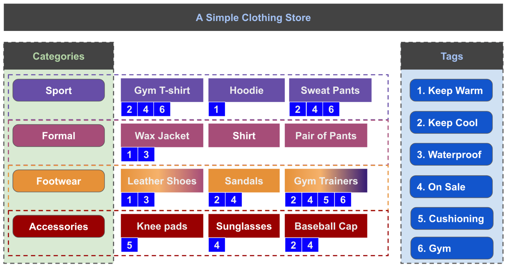
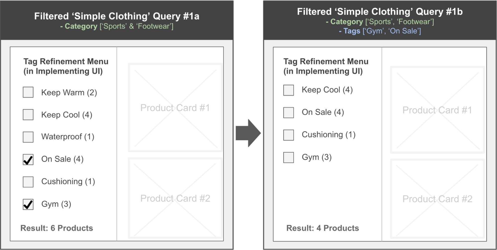
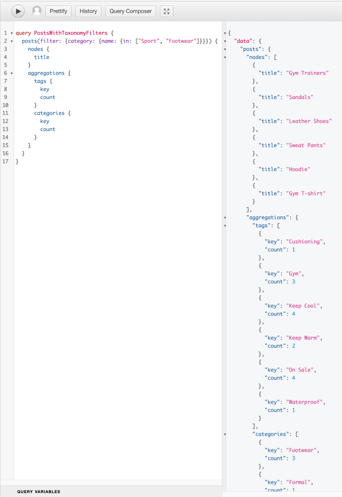
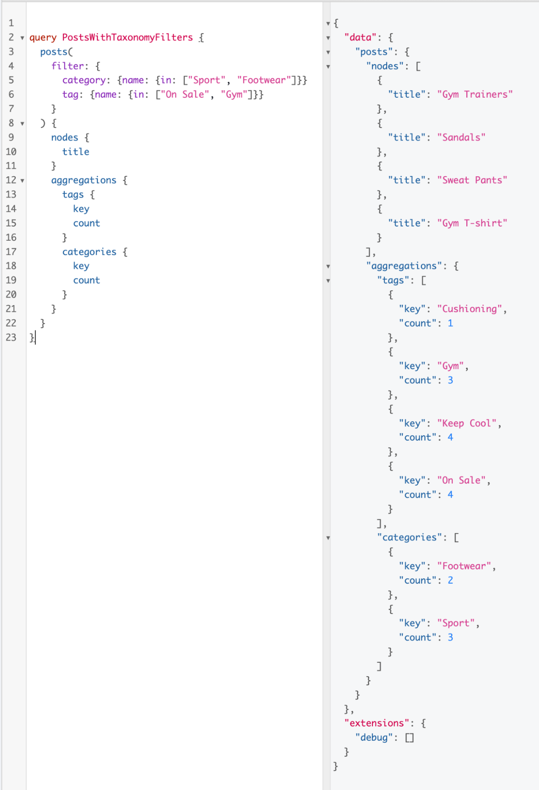
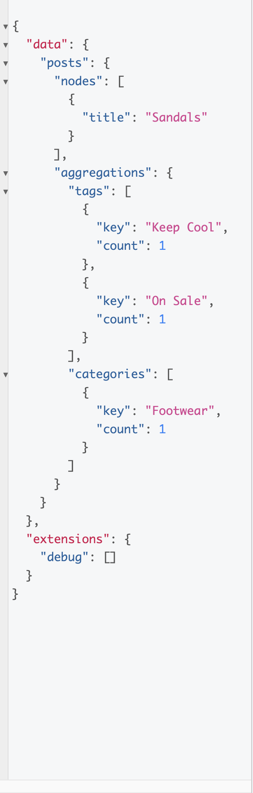
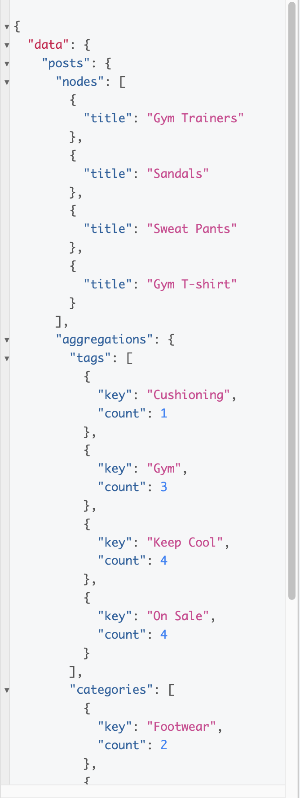

# WPGraphQL Filter Query

Adds taxonomy filtering and aggregation support to [WPGraphQL](https://www.wpgraphql.com).

- [WPGraphQL Filter Query](#wpgraphql-filter-query)
	- [WPGraphQL limitation](#wpgraphql-limitation)
		- [Solution](#solution)
	- [What are Filters (and Aggregates)](#what-are-filters-and-aggregates)
		- [Use Case Example](#use-case-example)
	- [Querying with Filters](#querying-with-filters)
	- [Advanced Queries](#advanced-queries)
		- [Multiple Comparison Operators on one Taxonomy](#multiple-comparison-operators-on-one-taxonomy)
		- [Multiple Relation Operators on Multiple Taxonomies](#multiple-relation-operators-on-multiple-taxonomies)
		- [Nesting Relation Operators on Multiple Taxonomies](#nesting-relation-operators-on-multiple-taxonomies)
	- [Readable Filter Queries](#readable-filter-queries)
	- [Dependencies](#dependencies)
		- [Install and Activate](#install-and-activate)
	- [Contributing](#contributing)
		- [Requirements](#requirements)
		- [Getting Started](#getting-started)
		- [Testing](#testing)
		- [Linting](#linting)
		- [VSCode](#vscode)

## WPGraphQL limitation

The introduction of WPGraphQL helped make access to WordPress headless data even easier than via REST, but there are still some areas and use-cases that are outside that repository’s existing focus or scope. From interfacing with the WPGraphQL team it was noted that there was a community desire for a query filter argument implementation to extend the existing plugin, which could support scenarios such as the **taxQuery** candidate [here](https://github.com/wp-graphql/wp-graphql/pull/1387).

### Solution

In collaboration with the WPGraphQL team we built this plugin to:

-   Add a `filter` WPGraphQL input argument connection, for all Post types, which supports the passing of multiple Taxonomies for refinement.
-   Add an `aggregation` field connection, available in the body of all Post types, which can return a sum of the names of each Taxonomy that occurs, and a count of the number of occurrences of each, in each query response.

## What are Filters (and Aggregates)

Filters allow the limiting of Post results by **Taxonomy** fields & values. Aggregates give a summary of such Taxonomies available to a given query - based on a sum of the resulting Posts associated Taxonomies. So, if I queried all Posts on _food_ (this would need to be the name of a related Taxonomy here) from a Lifestyle blog, I might expect to receive all food-related Posts, plus the sum of all Taxonomies that occurred within my Posts results - such as _sweet_ or _savory_, but probably not _home decor_ or _yoga_ (unless a topic related to both _food_ and _yoga_ perhaps).

Broadly speaking, WordPress Taxonomies have two default types: **Categories & Tags**. **Categories** are more of a grouping mechanism, which supports hierarchy and siblings (_animal-> feline-> tiger, lion, cat_), whereas **Tags** are more for additional shared information (_green, heavy, out-of-stock_).

### Use Case Example

Using an example of a fictional _Sample Clothing Store_ WordPress site we can further illustrate the use of filters. Here, the products are separated into 4, sometimes overlapping, Categories: _Sport_, _Formal_, _Footwear_ and _Accessories_ - there will be no inheritance Categories in this simple example, but some sibling Categories. There are 6 possible Tags also available, for further information on and grouping of the stock, and for shared traits: _Keep Warm_, _Keep Cool_, _Waterproof_, _On Sale_, _Cushioning_, and _Gym_. The 12 products are shown in the image below - 4 in each Category, but one can see _Leather Shoes_ shares both Formal and Footwear Categories, while _Gym Trainers_ shares both Sport and Footwear Categories. The blue numbers below each product show their associated Tags.



Now, if we pictured this sample store having its own website frontend (reading from our WordPress Headless WPGraphQL) which could display all of the products, and allow filtering by the Categories and Tags e.g. **query #1** image.

In this query the customer has visited perhaps a _Featured Sportswear & Footwear_ section, from one of the website’s homepage links, which automatically filter-queried the products by the given Categories of _Sport & Footwear_, while also returning the Aggregations of still-applicable Taxonomies (by name & occurrence count).

From this filter-by-category view the customer could then further refine what products they are interested in, by selecting only certain Tags from the Aggregated Tags returned (which was all 6 in this example). Next, in the **query #1** image below, one can see some of the Tag boxes being checked so that, by **query #2**, we can see the products returned from the filter-by-category-and-tag query have gone from 6 (Gym T-shirt, Hoodie, Sweat Pants, Leather Shoes, Sandals, Gym Trainers) to 4 (Gym T-shirt, Sweat Pants, Sandals, Gym Trainers) in number.

We can see in both query results that:

-   Of the 6 Products returned in **query #1**, there were occurrences of all 6 Tags with a sum of 15 instances (again, the aggregate/ sum of Tags, by name & counts).
-   By **query #2**, even though we specified 2 tags to filter by, the 4 Products returned contained a total of 4 associated Tags (each had both specified & unspecified Tags) and 12 instances.



This above example uses, by default, an `and` relationship between the specified Taxonomies, but this plugin supports both `AND` plus `OR` relationships within its filters - these are the **relation** operators. In this example a multiple-equality ‘in’ ‘comparison’ operator is used as the comparison for filtering, but this plugin supports all of the following comparison operators: `eq`, `notEq`, `like`, `notLike`, `in`, `notIn`.

## Querying with Filters

Given the **Simple Clothing Store** website above, we can start seeing how one would go about benefiting from filter queries in **query #1 and #2**. To replicate the backend needed to supply such frontend functionality we must first create a WP instance with **WPGraphQL** & our **WPGraphQL Filter Query** plugins installed and activated. Then we need to clear any default data and add the 4 Categories, 6 Tags, and 12 Products (as Posts) from our earlier data, and establish the specified relationships between our Products, Tags and Categories. Once this is done one can begin querying the data via WPGraphQL’s inbuilt GraphiQL IDE (a familiarity with this is assumed).

The **query #1** should look roughly like this, with Filter by Category:

```
query Query1 {
  posts(
    filter: {
      category: {
        name: {
          in: ["Sport", "Footwear"]
        }
      }
    }
  ) {
    nodes {
      title
    }
    aggregations {
      tags {
        key
        count
      }
      categories {
        key
        count
      }
    }
  }
}

```



**Query #2** builds on 1, with the addition of selected (UI-checked) Tags to Filter.

When we add Tags to the filter an implicit Relation Operator of `and` is applied between the Category and the Tag objects - _if (Category-match && Tag-match) return Post(s)_.

```
query Query2 {
  posts(
    filter: {
      category: {
        name: {
          in: ["Sport", "Footwear"]
        }
      }

      tag: {
        name: {
          in: ["On Sale", "Gym"]
        }
      }
    }
  ) {
    nodes {
      title
    }

    aggregations {
      tags {
        key
        count
      }

      categories {
        key
        count
      }
    }
  }
}
```



## Advanced Queries

### Multiple Comparison Operators on one Taxonomy

If the **query #2** was taken a step further to perhaps exclude the _Gym Tag_, we could see only _Sandals_ would make a return as _On Sale_. This is the lowest level of chaining operators, and the relation operator for these will always be `and`. We also see a new Comparison Operator, coupled with the previous one: `notEq`:

```
query ProductsByFilterNotEqGym {
  posts(
    filter: {
      category: {
        name: {
          in: ["Sport", "Footwear"]
        }
      },

      tag: {
        name: {
          in: ["On Sale", "Gym"],
          notEq: "Gym"
        }
      }
    }
  ) {
    nodes {
      title
    }

    aggregations {
      tags {
        key
        count
      }

      categories {
        key
        count
      }
    }
  }
}
```



### Multiple Relation Operators on Multiple Taxonomies

This plugin supports 4 root filter query arguments presently:

-   2 Taxonomies: ‘Tag’ & ‘Category’ (Covered already)
-   2 Relation Operators: `or` & `and`
    -   These cannot appear as siblings, so use one or neither, per nested object
    -   These accept an array of root filter query objects (so, each object of array itself can have Taxonomies, or/and Relation Operators, recursively)
    -   Nested filter query objects can be nested up to 10 times presently

Given **query #2** as a starting point, we could separate the two Tags to be searched into their own filter query object, inside an `or` Relation Operator and get the same result (Also switched the Comparison Operator here to `eq`, vs `in` as there was only one Tag comparison made in each object now):

```
query ProductsByFilterOROperator {
  posts(
    filter: {
      category: {
        name: {
          in: ["Sport", "Footwear"]
        }
      },
      or: [
        {
          tag: {
            name: {
              eq: "On Sale",
            }
          }
        },{
          tag: {
            name: {
              eq: "Gym",
            }
          }
      	}
      ]
    }
  ) {
    nodes {
      title
    }

    aggregations {
      tags {
        key
        count
      }

      categories {
        key
        count
      }
    }
  }
}
```



### Nesting Relation Operators on Multiple Taxonomies

If we simply swap the Relation Operator to `and` now on this previous query our results now must contain both Tag Comparison Operator matches, rather than either or. This eliminates _Sandals_, which only had the _On Sale_ Tag, but not the _Gym_ one.

```
query ProductsByFilterANDOperator {
  posts(
    filter: {
      category: {
        name: {
          in: ["Sport", "Footwear"]
        }
      },
      and: [
        {
          tag: {
            name: {
              eq: "On Sale",
            }
          }
        },{
          tag: {
            name: {
              eq: "Gym",
            }
          }
      	}
      ]
    }
  ) {
    nodes {
      title
    }

    aggregations {
      tags {
        key
        count
      }

      categories {
        key
        count
      }
    }
  }
}
```


## Readable Filter Queries

Using the relation operators are powerful, and were made to be siblings of Taxonomies, but, for greatest clarity do not reply on the implicit `and` relation of siblings at filter query level. As mentioned, nesting of queries is available via relation operators, up to a depth of 10, but this may be somewhat unreadable, like nested callbacks.

## Dependencies

In order to use WPGraphQL Filter Query, you must have [WPGraphQL](https://www.wpgraphql.com) installed and activated.

### Install and Activate

WPGraphQL Filter Query is not currently available on the WordPress.org repository, so you must [download it from Github](https://github.com/wpengine/wp-graphql-filter-query/archive/refs/heads/main.zip).

[Learn more](https://wordpress.org/support/article/managing-plugins/) about installing WordPress plugins from a Zip file.

## Contributing

### Requirements

-   Docker

### Getting Started

To get started with the dev environment run

```
make
```

### Testing

```
make test
```

### Linting

```
make lint
```

### VSCode

Install the following plugins to gain formatting and lint errors showing up in the editor


